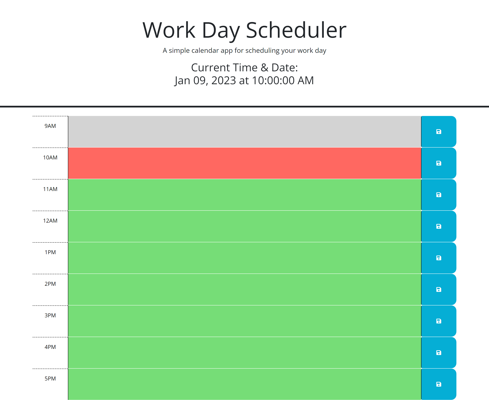

# Work-Day-Scheduler
Making a work day scheduler with JavaScript, jQuery, HTML and CSS
# WORK-DAY-SCHEDULER

I was tasked with creating a work day scheduler that saves inputs to local storage and changes the color of the respected container depending on the current time of day. Using JavaScript, Jquery, HTML, CSS and Day.js I added the logic and styling needed to achieve the final product.

Firstly, the JavaScript grabs onto each needed html element using JQuery. Then I have created more functions and logic wrapped in a JQuery function so that it doesn't happen before the page loads. The first function is a for loop that checks the time of day against the respective block for each hour of the work day. Once it decides if the current time is past, present, or future it adds a class that turns the container gray, green, or red respectively. Next I set a click listener for all of the save buttons that sets the current text and element id to local storage. Next I have a function that looks for local storage and adds it to the page. This is called at page load to make sure that inputs previously received are loaded first. The last function displays the current date and time at the top of the page and resets on a 1 second interval.

Here is a screenshot of the finished application: 

[Here is a link to the deployed application](https://bram-g.github.io/Work-Day-Scheduler/)